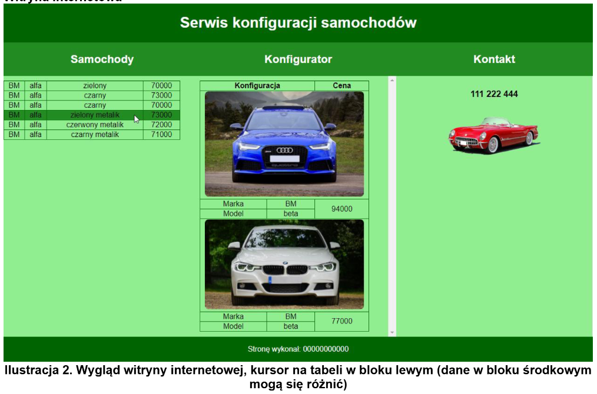
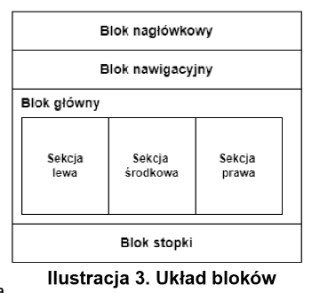

## Wykonaj stronę internetową obsługującą serwis konfiguracji samochodów

Cechy witryny:
- Składa się ze strony o nazwie index.html
- Zapisana w języku HTML5
- Zadeklarowany polski język zawartości witryny
- Jawnie zastosowany właściwy standard kodowania polskich znaków
- Tytuł strony „Konfigurator samochodów”
- Arkusz stylów w pliku o nazwie styl.css prawidłowo połączony z kodem strony
- Podział strony na bloki zrealizowany za pomocą semantycznych znaczników bloków języka HTML5 tak, aby po uruchomieniu w przeglądarce układ bloków na stronie był zgodny z ilustracją
- Zawartość bloku nagłówkowego: nagłówek pierwszego stopnia o treści „Serwis konfiguracji samochodów”
- Zawartość bloku nawigacyjnego: trzy nagłówki drugiego stopnia o treści: „Samochody”, „Konfigurator”, „Kontakt”
- Zawartość bloku głównego: blok sekcji lewej, środkowej i prawej
- Zawartość bloku sekcji lewej: tabela z czterema kolumnami
- Zawartość bloku sekcji środkowej:
    - Tabela z trzema kolumnami i siedmioma wierszami, niektóre komórki są scalone zgodnie z ilustracją
    - W pierwszym wierszu tabeli komórki nagłówkowe: „Konfiguracja”, „Cena”
    - W drugim wierszu tabeli obraz a1.jpg z tekstem alternatywnym „Konfiguracja 1”
    - W trzecim i czwartym wiersz tabeli zgodnie z ilustracją
    - W piątym wierszu tabeli obraz a2.jpg z tekstem alternatywnym „Konfiguracja 2”
    - W szóstym i siódmym wierszu tabeli zgodnie z ilustracją
- Zawartość bloku sekcji prawej:
    - Nagłówek trzeciego stopnia o treści „111 222 444”
    - Obraz a3.png z tekstem alternatywnym „Samochód”
    - Zawartość stopki: paragraf o treści: „Stronę wykonał: ”, dalej wstawione Twoje imię i nazwisko.

Styl CSS witryny internetowej

Styl CSS zdefiniowany jest w całości w zewnętrznym pliku o nazwie styl.css. Cechy formatowania CSS, działające na stronie:
- Domyślnie dla wszystkich selektorów: wyrównanie tekstu do środka, krój czcionki Helvetica,
w przypadku braku, sans-serif
- Wspólne dla bloków nagłówkowego, nawigacyjnego i stopki: biały kolor czcionki, marginesy
wewnętrzne 2 px
- Dodatkowo dla bloków nagłówkowego i stopki: kolor tła DarkGreen oraz dla bloku nawigacyjnego kolor tła ForestGreen
- Dla wszystkich bloków sekcji: kolor tła LightGreen, szerokość 33.3%, wysokość 550 px, jedynie górny margines wewnętrzny 10 px, paski przewijania widoczne jedynie w przypadku przepełnienia bloku
- Dla selektora nagłówka drugiego stopnia: szerokość 33%, sposób wyświetlania elementu liniowoblokowy
- Wspólne dla selektora tabeli, komórki tabeli i komórki nagłówkowej: obramowanie linią ciągłą o szerokości 1 px i kolorze DarkGreen
- Dodatkowo dla selektora tabeli: szerokość 90%, linie obramowania połączone
- Jedynie dla obrazów z bloku środkowego: szerokość 95%, zaokrąglenie rogów 8 px
- Jedynie dla wierszy tabeli z bloku lewego: gdy kursor znajdzie się na wierszu tabeli jego kolor tła zmienia się na ForestGreen (jak na ilustracji)