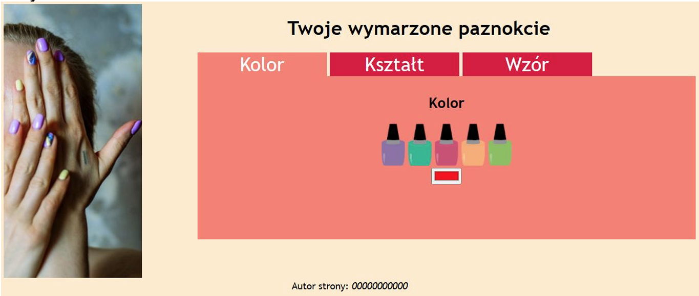
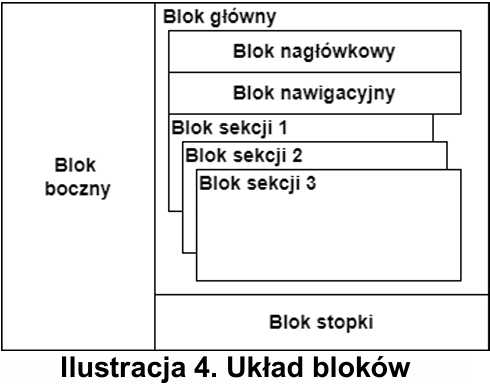

## Wykonaj stronę internetową "Twoje wymarzone paznokcie"

Cechy witryny:
- Składa się ze strony o nazwie paznokcie.html
- Zapisana w języku HTML5
- Zadeklarowany polski język zawartości witryny
- Jawnie zastosowany właściwy standard kodowania polskich znaków
- Tytuł strony widoczny na karcie przeglądarki: "Stylizacja paznokci"
- Arkusz stylów w pliku o nazwie styl.css prawidłowo połączony z kodem strony
- Podział strony na bloki zrealizowany za pomocą semantycznych znaczników bloków języka HTML5 tak, aby po uruchomieniu w przeglądarce układ bloków na stronie był zgodny z ilustracją
- Zawartość bloku bocznego: dowolny obraz z tekstem alternatywnym „Stylizacja paznokci” 
- Zawartość bloku głównego: blok nagłówkowy, blok nawigacyjny, bloki: sekcja 1, sekcja 2, sekcja 3. Każdy z bloków sekcji jest zdefiniowany w osobnym pliku HTML.
- Zawartość bloku nagłówkowego: Nagłówek pierwszego stopnia o treści „Twoje wymarzone paznokcie” 
- Zawartość bloku nawigacyjnego: 
    - Przycisk o treści „Kolor” 
    - Przycisk o treści „Kształt” 
    - Przycisk o treści „Wzór” 
    - Kliknięcie w każdy z przycisków ma przenosić na odpowiednią podstronę HTML
- Zawartość bloku sekcja 1:
    - Zawartość tej sekcji jest umieszczona w pliku index.html 
    - Nagłówek drugiego stopnia o treści „Kolor” 
    - Dowolny obraz z tekstem alternatywnym „Kolory paznokci” 
    - Poniżej pole edycyjne pozwalające wybrać kolor, wartość początkowa pola: #FF0000
- Zawartość bloku sekcja 2: 
    - Zawartość tej sekcji jest umieszczona w pliku ksztalt.html
    - Nagłówek drugiego stopnia o treści „Kształt” 
    - Dowolny obraz z tekstem alternatywnym „Kształty paznokci”
    - Poniżej pole listy rozwijanej z opcjami: „migdał”, „zaokrąglony”, „kwadratowy”, „balerina”, „zaokrąglony kwadrat” 
- Zawartość bloku sekcja 3: 
    - Zawartość tej sekcji jest umieszczona w pliku wzor.html
    - Nagłówek drugiego stopnia o treści „Wzór” 
    - Dwa dowolne obrazy z przypisaną klasą "wzory"
    - Pole edycyjne przeznaczone do wpisywania wartości całkowitych jedynie od 1 do 10 
- Zawartość bloku stopki: 
    - Paragraf o treści „Autor strony: ”, dalej wstawione Twoje imię i nazwisko. Numer zdającego jest zapisany za pomocą znacznika semantycznego oznaczającego tekst uwypuklony, formatowany domyślnie jako pochylony 

Styl CSS zdefiniowany jest w całości w zewnętrznym pliku o nazwie styl.css. Cechy formatowania CSS działające na stronie: 
- Domyślnie, dla wszystkich selektorów: krój czcionki Trebuchet MS, w przypadku braku sans-serif 
- Dla ciała strony: kolor tła BlanchedAlmond, wyrównanie tekstu do środka 
- Dla bloku bocznego: szerokość 20% 
- Jedynie dla obrazu w bloku bocznym: szerokość 100% 
- Dla bloku głównego: szerokość 80% 
- Dla bloku nawigacyjnego: wyrównanie tekstu do lewej strony, jedynie margines zewnętrzny lewy 10% 
- Dla trzech bloków sekcji: kolor tła Salmon, jedynie margines zewnętrzny lewy 10%, marginesy wewnętrzne 10 px, wysokość 250 px 
- Dodatkowo bloki sekcji wyświetlane w sposób blokowy
- Dla przycisków: szerokość 26%, biały kolor czcionki, brak obramowania, rozmiar czcionki 200% 
- Dodatkowo dla przycisku odpowiadającemu aktualnej sekcji kolor tła Salmon, dla pozostałych – Crimson 
- Dla klasy wzory: szerokość 70 px, marginesy zewnętrzne 5 px, zaokrąglenie rogów 100% 