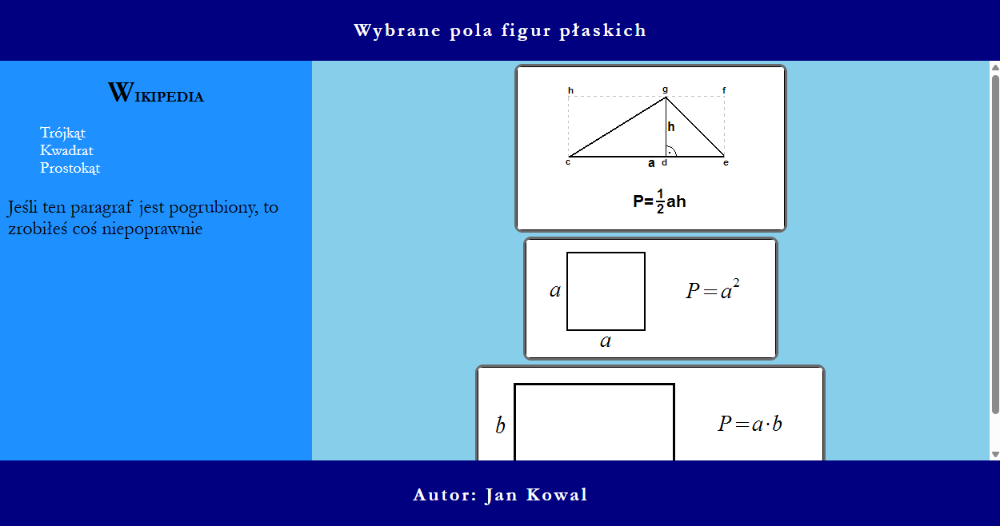
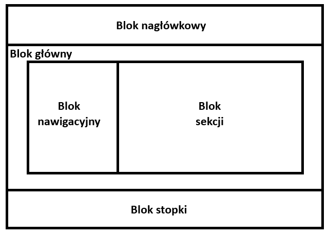

Cechy witryny:

- Składa się ze strony z twoim imieniem i nazwiskiem w formacie: imie-nazwisko.html, np. jan-kowal.html
- Wygląd strony pokrywa się ze stroną przedstawioną na ilustracji
- Zadeklarowany polski język zawartości witryny
- Jawnie zastosowany właściwy standard kodowania polskich znaków
- Tytuł strony widoczny na karcie przeglądarki: "Pola figur"
- Arkusz stylów w pliku o nazwie styl.css prawidłowo połączony z kodem strony
- Podział strony na bloki zrealizowany za pomocą semantycznych znaczników bloków języka HTML5 tak, aby po uruchomieniu w przeglądarce układ bloków na stronie był zgodny z układem na ilustracji
- Zawartość bloku nagłówkowego: nagłówek drugiego stopnia o treści "Wybrane pola figur płaskich"
- Zawartość bloku głównego: blok nawigacyjny i blok sekcji
- Zawartość bloku nawigacyjnego:
  - Nagłówek trzeciego stopnia o treści "WIKIPEDIA"
  - Lista punktowana (nieuporządkowana) z dwoma odsyłaczami o treści:
    - "Trójkąt", prowadzący do strony "https://pl.wikipedia.org/wiki/Tr%C3%B3jk%C4%85t"
    - "Kwadrat" prowadzący do strony "https://pl.wikipedia.org/wiki/Kwadrat"
    - "Prostokąt", prowadzący do strony "https://pl.wikipedia.org/wiki/Prostok%C4%85t"
  - Paragraf o treści: "Jeśli ten paragraf jest pogrubiony, to zrobiłeś coś niepoprawnie"
- Zawartość bloku sekcji:
  - Obraz o źródle "https://bazywiedzy.com/gfx/wzor-na-pole-trojkata.png" z tekstem alternatywnym "Trójkąt"
  - Obraz o źródle "https://bazywiedzy.com/gfx/pole-kwadratu.png" z tekstem alternatywnym "Kwadrat"
  - Obraz o źródle "https://bazywiedzy.com/gfx/pole-prostokata-3.png" z tekstem alternatywnym "Prostokąt"
  - Do wszystkich obrazów należy przypisać tę samą klasę
- Zawartość stopki: paragraf o treści: "Autor: ", dalej wpisane imię i nazwisko zdającego.

Styl CSS witryny internetowej:

- Zdefiniowany jest w całości w zewnętrznym pliku o nazwie styl.css
- Domyślnie, dla wszystkich selektorów:
  - krój czcionki Garamond, w przypadku braku serif
- Wspólne dla bloku nagłówkowego i stopki:
  - kolor tła Navy
  - biały kolor czcionki
  - wyrównanie tekstu do środka
  - marginesy wewnętrzne 5 px
  - odstępy między literami 3 px
- Dodatkowo tylko dla paragrafu, znajdującego się w stopce:
  - pogrubienie tekstu
- Wspólne dla bloku nawigacyjnego i sekcji:
  - wysokość 500 px
- Dodatkowo dla bloku nawigacyjnego:
  - kolor tła DodgerBlue
  - szerokość 30%
  - marginesy wewnętrzne od lewej i prawej strony na 10 px
- Dodatkowo dla bloku sekcji:
  - kolor tła SkyBlue
  - szerokość 70%
  - wyrównanie tekstu do środka
  - paski przewijania widoczne w przypadku przepełnienia bloku
- Dla selektora nagłówka trzeciego stopnia:
  - wyrównanie tekstu do środka
  - pierwsza litera nagłówka ma rozmiar czcionki 200%
- Dla selektora paragrafu:
  - rozmiar czcionki 150%
- Dla selektora odnośnika:
  - brak podkreślenia tekstu
  - biały kolor czcionki
  - rozmiar czcionki 20px
- Dla selektora listy punktowanej (nieuporządkowanej):
  - brak typu stylu listy (usunięcie domyślnych punktorów)
- Dla klasy przypisanej do grafik:
  - wyświetlanie blokowe
  - obramowanie linią ciągłą 3 px o kolorze DimGray
  - zaokrąglenie rogów 10 px
  - marginesy zewnętrzne
    - od góry oraz od dołu 5 px
    - z lewej i z prawej auto
  - kursor pointer
- Dla klasy przypisanej do grafik w przypadku najechania kursorem na element:
  - powiększenie elementu 1.2 raza
