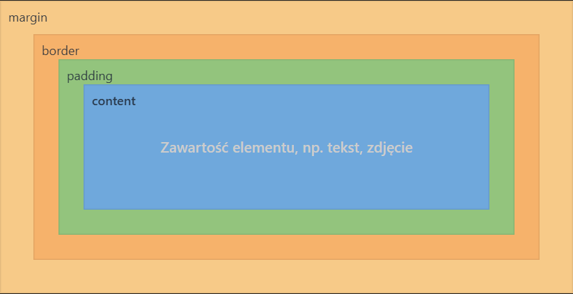

# Model blokowy CSS

## Omówienie wszystkich właściwości CSS poznanych na lekcji dotyczącej modelu blokowego.

### 1. **Margines zewnętrzny – `margin`**
- Odpowiada za przestrzeń na zewnątrz elementu, oddzielając go od innych elementów.
- Marginesy **nie wchodzą** w obszar elementu.
- Przykładowe właściwości i wartości:
  - `margin: 0` – brak marginesów.
  - `margin-top: 50px`
  - `margin-bottom: 20px`
  - `margin-left: 25px`
  - `margin-right: 25px`
  - `margin-left: auto; margin-right: auto` – wyśrodkowanie elementu w poziomie.
- Skrócone zapisy:
  - `margin: 20px 100px` – góra/dół oraz lewo/prawo
  - `margin: 20px 100px 20px 100px` – góra, prawo, dół, lewo
  - `margin: 20px 100px 20px` – góra, lewo-prawo, dół

---

### 2. **Wewnętrzny odstęp – `padding`**
- Odpowiada za przestrzeń pomiędzy zawartością elementu a jego obramowaniem.
- Przykładowe właściwości:
  - `padding-top: 20px`
  - `padding-bottom: 10px`
  - `padding-left: 40px`
  - `padding-right: 15px`
- Skrócone zapisy:
  - `padding: 20px 100px` – góra/dół oraz lewo/prawo
  - `padding: 20px 100px 20px 100px` – góra, prawo, dół, lewo
  - `padding: 20px 100px 20px` – góra, lewo-prawo, dół

---

### 3. **Obramowanie – `border`**
- Tworzy ramkę wokół elementu, będącą częścią modelu blokowego.
- Składa się z trzech właściwości:
  - `border-width` – grubość obramowania (`3px`, `1px`)
  - `border-style` – styl obramowania:
    - `solid` – linia ciągła  
    - `dotted` – kropki  
    - `dashed` – kreski  
    - `none` – brak obramowania
  - `border-color` – kolor obramowania (np. `blueviolet`, `red`, `black`)
- Skrócony zapis:
  - `border: 3px solid red`

---

### 4. **Szerokość elementu – `width`**
- Określa szerokość obszaru zawartości elementu.
- Przykładowe wartości:
  - `50%` – szerokość względna względem elementu nadrzędnego.
  - `200px`, `150px` – szerokość bezwzględna.
- Dodatkowo możemy określić minimalną lub maksymalną wysokość elementu przy pomocy **`min-width`** oraz **`max-width`**

---

### 5. **Wysokość elementu – `height`**
- Ustawia wysokość obszaru zawartości elementu.
- Przykładowe wartości:
  - `100px`
  - `200px`
- Dodatkowo możemy określić minimalną lub maksymalną wysokość elementu przy pomocy **`min-height`** oraz **`max-height`**

---

### 6. **Obrys elementu – `outline`**
- Tworzy linię wokół elementu, ale w odróżnieniu od **`border`** nie wpływa na jego rozmiar.
- Przykładowa wartość:
  - `outline: 5px solid black`

---

### 7. **Zarządzanie przepełnieniem – `overflow`**
- Określa zachowanie elementu, gdy jego zawartość wykracza poza ustalone wymiary.
- Dla pojedyczych osi możemy użyć właściwości **`overflow-x`** lub **`overflow-y`**
- Przykładowa wartość:
  - `auto` – dodaje paski przewijania tylko wtedy, gdy element nie mieści się w rozmiarach swojego kontenera.

---

### 8. **Rodzaj wyświetlania – `display`**
- Określa sposób, w jaki element jest wyświetlany.
- Przykładowa wartość:
  - `inline-block` – element blokowy, który nie zajmuje całej szerokości i może stać obok innych elementów.

## Graficzna prezentacja modelu blokowego

